# CUDA Path Tracer

**University of Pennsylvania, CIS 565: GPU Programming and Architecture, Project 3**

- Dineth Meegoda
  - [LinkedIn](https://www.linkedin.com/in/dinethmeegoda/), [Personal Website](https://www.dinethmeegoda.com).
- Tested on: Windows 10 Pro, Ryzen 9 5900X 12 Core @ 3.7GHz 32GB, RTX 3070 8GB

## Summary

This project is a foray into learning CUDA, specifically for graphics programming applications. The goal of this Path Tracer was to take the existing graphics concepts I'm already familiar with, and try to use parallel programming on the GPU with separate kernel invocations to 'simulate' the steps in the graphics pipeline that graphics frameworks typically abstract away. In the end, I wanted to implement as many visually striking features as I could to increase the number of tools I have to create pretty pictures, while making performance boosts to keep the path tracer usable for complex scenes.

### Path Tracing

Path tracing is a rendering technique where we 'shoot' out rays of light from each pixel and follow it's path to figure out what the contribution of light is given to that pixel. The specific color and direction of a ray depends on the materials it intersects and its physical properties. The specific kind of Path Tracing done in this program uses the Monte-Carlo Method in which a random sample is selected and divided by the value of a probability density function to make up for the contribution. Since it's random, one sample isn't enough to obtain an accurate image, so we average samples and eventually get an image we're happy with.

For more on path tracing, check out [PBRT](https://pbr-book.org/4ed/contents), which really helped me out during this project.

### Features Implemented

- Visual Features:
  - [BSDFs/BRDFs](#bsdfsbrdfsbtdf)
  - [Stochastic Sampled Anti-Aliasing](#stochastic-sampled-anti-aliasing)
  - [glTF Mesh Loading & Texture Mapping](#gltf-mesh-loading--texture-mapping)
  - [Reinhard Operator & Gamma Correction](#reinhard-operator--gamma-correction)
  - [Environment Mapping](#environment-mapping)
  - [Ray Dispersion](#ray-dispersion)
  - [Proceudral Shapes](#procedural-shapes)
  - [Procedural Textures](#procedural-textures)
  - [Denoising](#denoising)
- Performance Features:
  - [Bounding Volume Heirarchy](#bounding-volume-hierarchy)
  - [Stream Compaction](#stream-compaction)
  - [Material Sorting](#material-sorting)

## Visual Features

These are the features I implemented to help things look physically accurate (and pretty).

### BSDFs/BRDFs/BTDF

A BSDF/BRDF/BTDF is a function that defines a material by how it scatters rays of light when they intersect with it. A BSDF Scatters lights, BRDFs Reflect light, and BTDFs Transmit Light. With these functions, a number of materials were implemented.

The implemented BSDF represents diffuse surfaces, while the BRDF represents perfectly reflective surfaces, such as a mirror.

<table>
  <tr>
    <td>
      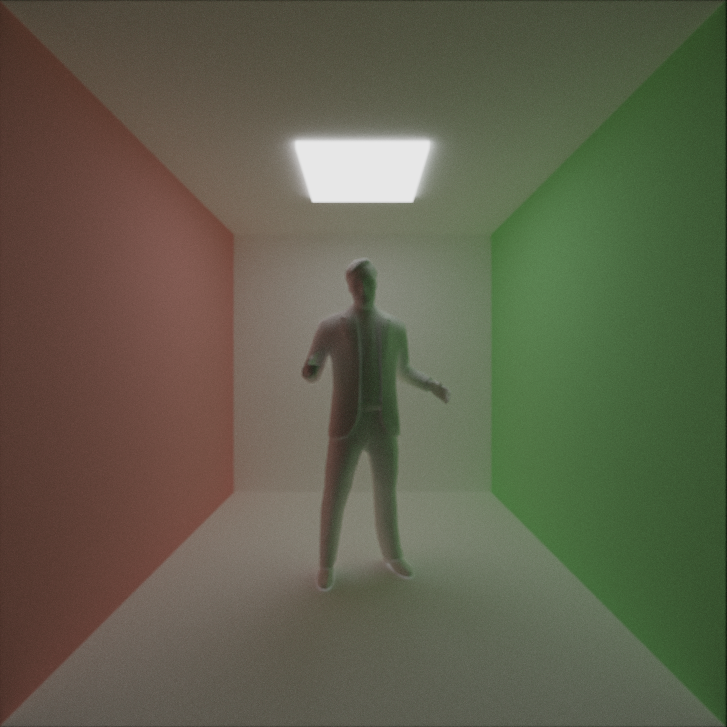
      
BSDF Saul Goodman

    </td>
    <td>
      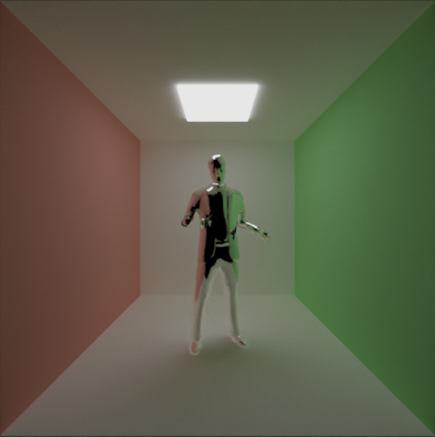
      
BRDF Saul Goodman

    </td>
  </tr>
</table>

These Distribution Functions can be used in tandem to represent specular diffuse surfaces like plastic with varying amounts of 'roughness'. The more rough a material is, the more diffuse the surface acts.

<table>
  <tr>
    <td>
      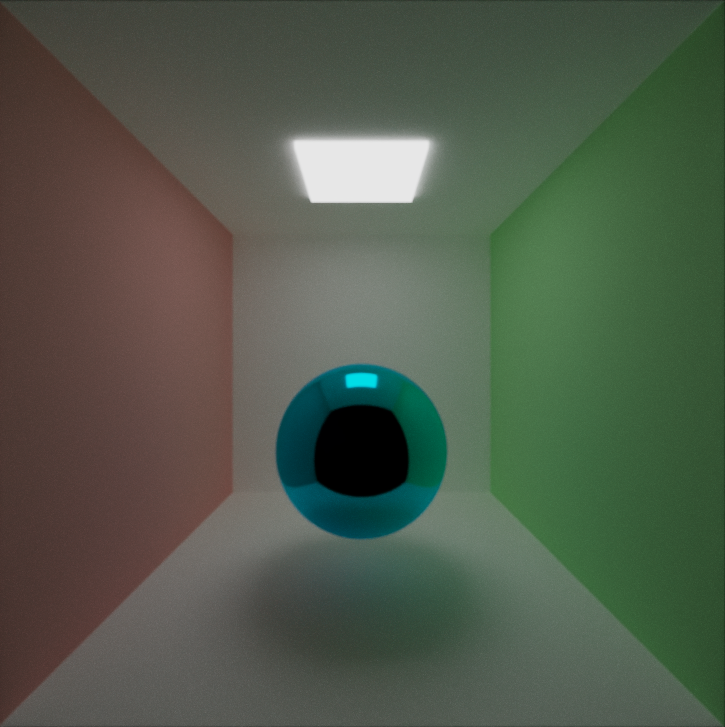
      
0% Roughness

    </td>
    <td>
      
      
30% Roughness

    </td>
  </tr>
  <tr>
    <td>
      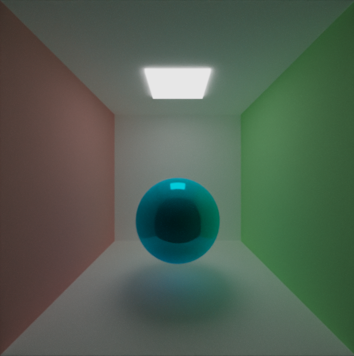
      
50% Roughness

    </td>
    <td>
      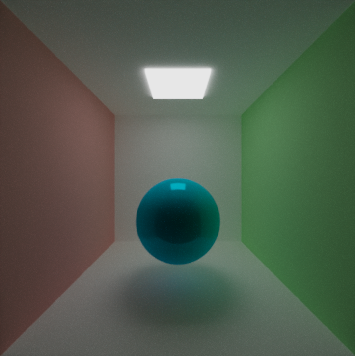
      
80% Roughness

    </td>
  </tr>
  </tr>
</table>
      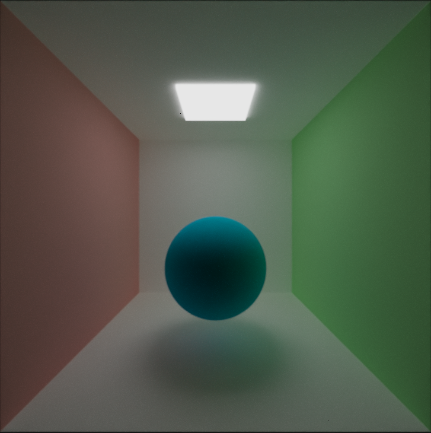
      
100% Roughness

Finally, we have the BTDF, which transmits light through an object. This can be combined with the BRDF to create a glass like material. BTDF materials have an Index of Refraction (IOR) component which describes how much light should bend (refract) while passing through an object.

<table>
  <tr>
    <td>
      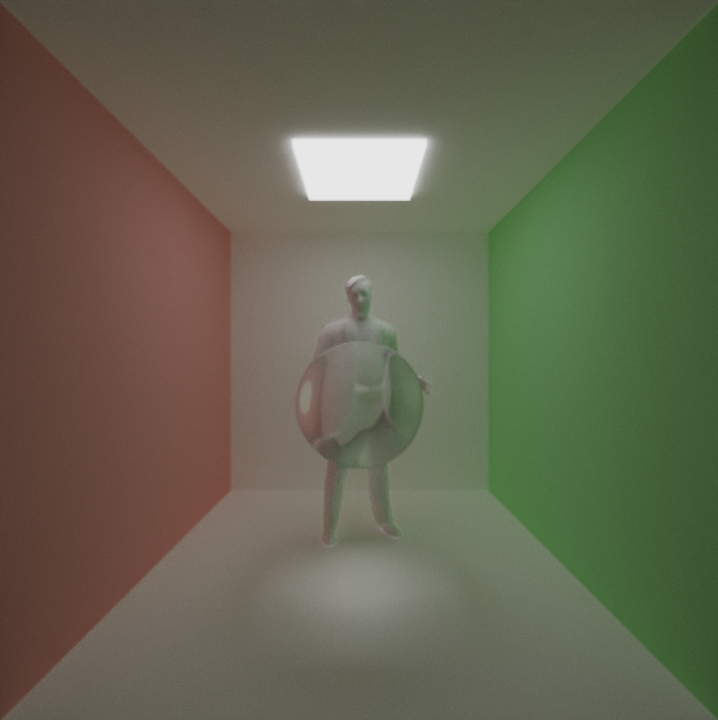
      
BTDF with IOR 1.33

    </td>
    <td>
      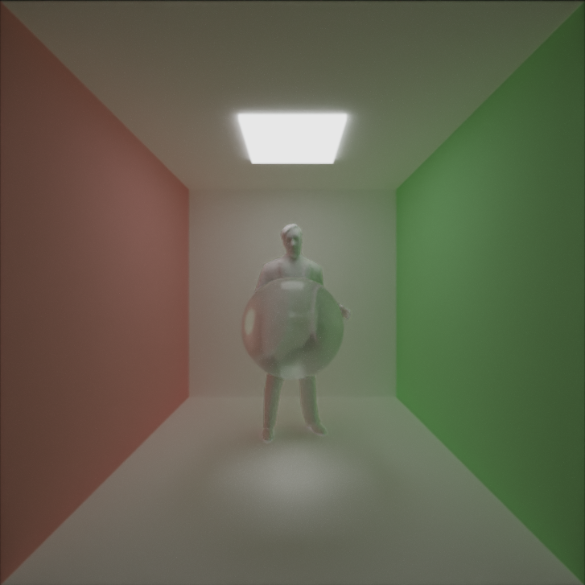
      
BTDF/BRDF with IOR 1.6

    </td>
  </tr>
</table>

### Stochastic Sampled Anti-Aliasing

Aliasing happens during rasterization where jagged edges form on the edges of polygons when drawing to pixels. However, since we are path tracing, we can use a technique called Stochastic Sampled Anti-Aliasing to natually anti-aliase the image. This is done by randomly jittering the ray within each pixel so that the ray will not hit the edge of the object everytime. As we take the average of several samples, this effectively 'blurs' out the edges and gets rid of the aliasing. The more we jitter, the more we get rid of these edges, but the image gets more blurry as well.

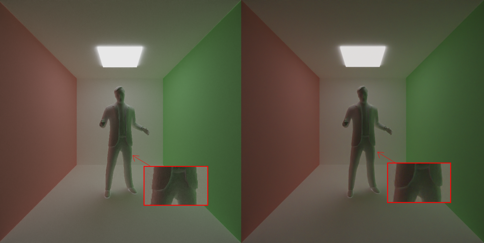

Without SSAA (Left) and With SSAA (Right)

### glTF Mesh Loading & Texture Mapping

In order to have more than just boxes and spheres in our scene, I implemented arbritary mesh loading with the glTF file format. glTF is being used in the industry much more often, and contains inherent references to different texture maps within the file. In order to parse this format, I used the [tinyglTF Library](https://github.com/syoyo/tinygltf) and the Khronos Group's [Guide to parsing glTF files](https://www.slideshare.net/slideshow/gltf-20-reference-guide/78149291#1). Some reinterpret casts later, I had the data loaded into my pathtracer.

After parsing the vertices, we can create flat normals by taking the cross product of the triangle edges. However, it's usually better to perform barycentric interpolation with the vertex normals to obtain 'smooth shading' on the model. Barycentric interpolation was also used to map the model's texture files onto itself.

<table>
  <tr>
    <td>
      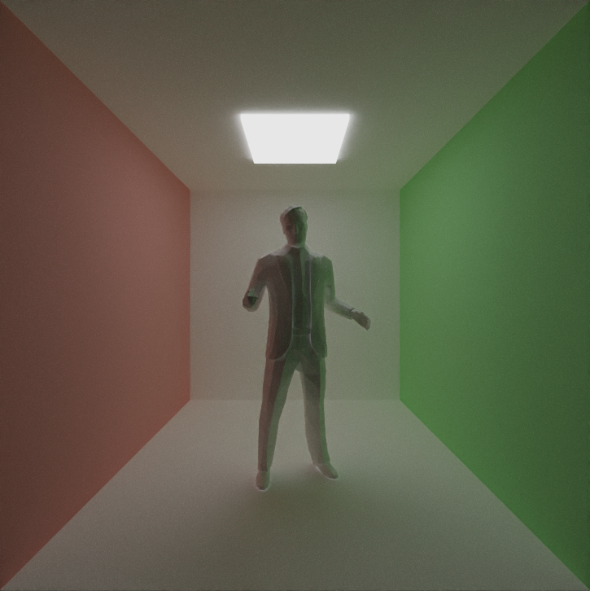
      
Flat Normal Shading with Cross Product (Low Poly Look)

    </td>
    <td>
      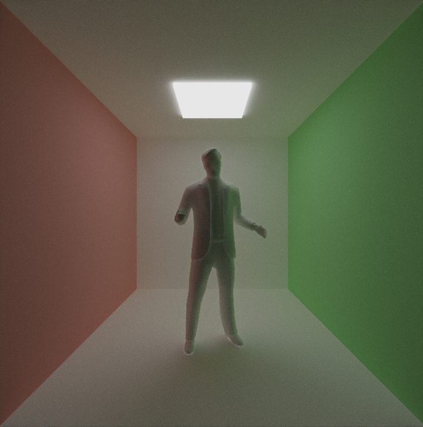
      
Smooth Shading with Barycentric Interpolation on Normals

    </td>
  </tr>
  <tr>
      <td>
      
      
Saul's Albedo Texture Map

    </td>
    <td>
      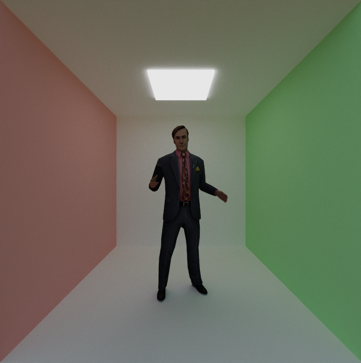
      
Texture Map applied to Saul with Barycentric Interpolation

    </td>
  </tr>
</table>

### Reinhard Operator & Gamma Correction

I also implemented some post processing onto the image in order to more accurately represent the scene as if it was captured by a real digital camera. First, I implemented the Reinhard operator, which is used to map the High Dynamic Range Image to a lower range output device, such as digital monitors.

Then the image was gamma corrected from the RGB value of a pixel to the actual luminance of the color so that our eyes can see the colors as if it was captured by a real digital camera.

<table>
  <tr>
    <td>
      
      
Without Reinhard Operator & Gamma Correction

    </td>
    <td>
      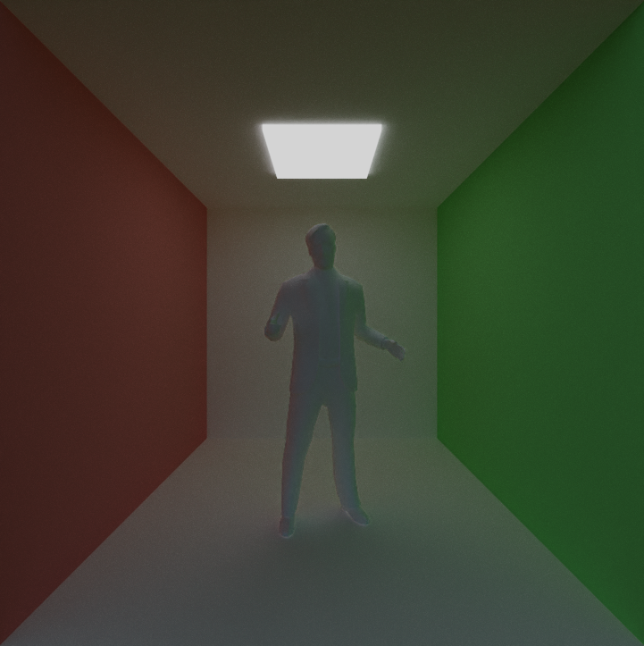
      
With only Reinhard Operator

    </td>
  </tr>
  <tr>
    <td>
      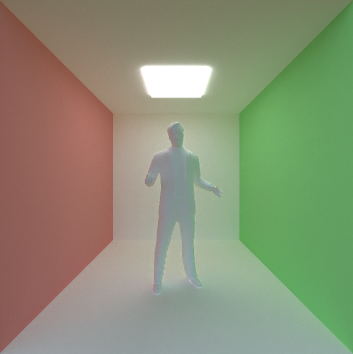
      
With only Gamma Correction

    </td>
    <td>
      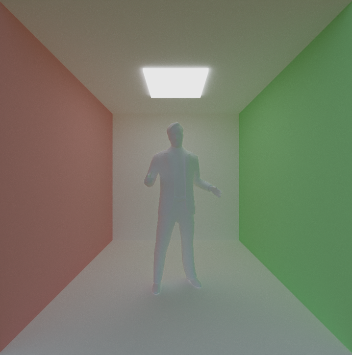
      
With both Reinhard Operator & Gamma Correction

    </td>
  </tr>
</table>

### Environment Mapping

In order to have scenes that take place anywhere other than indoors, it would be ideal to have the outside anything other than the black void that is returned when rays intersect with anything but geometry. To instead have better visuals and have an additional source of light, I implemented spherical environment mapping.

With an high definition image that's mapped onto a sphere, we can sample the color at the pixel that corresponds to the direction our ray bounces to simulate being in an environment.
  

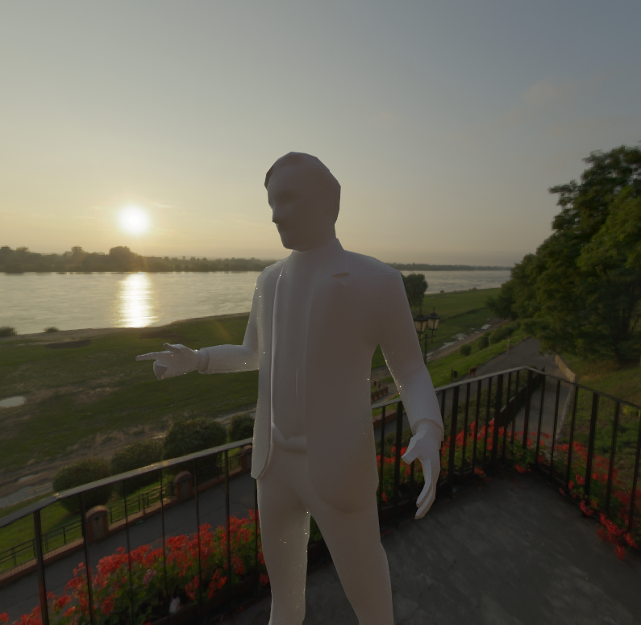

Nice Romantic European Evening with Saul.

### Ray Dispersion

In some refractive materials, ray dispersion occurs. This happens when some materials refract different rays of light differently based on their wavelength of visible light. This allows for chromatic aberration/prismatic effects.

This was implemented by mapping each wavelength of light from 360 nm to 850 nm to a color and passing it to the GPU as constant memory. Each ray would be randomly assigned a wavelength and be set to that specific color. Based on the material's dispersion coefficient, the ray would refract differently based on its wavelength.

<table>
  <tr>
    <td>
      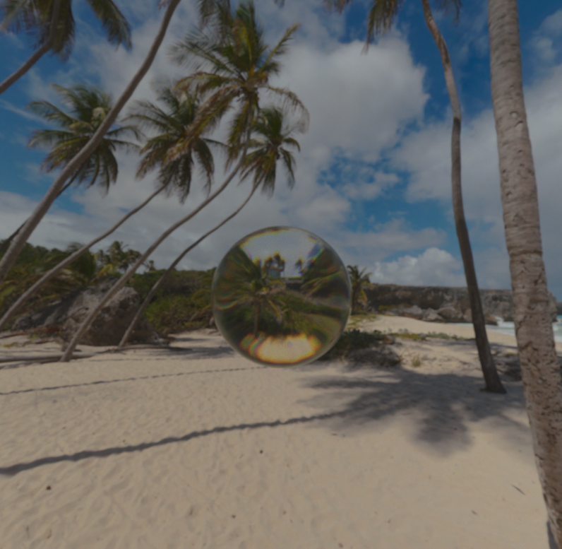
      
Sphere Dispersion with coefficent 0.2

    </td>
    <td>
      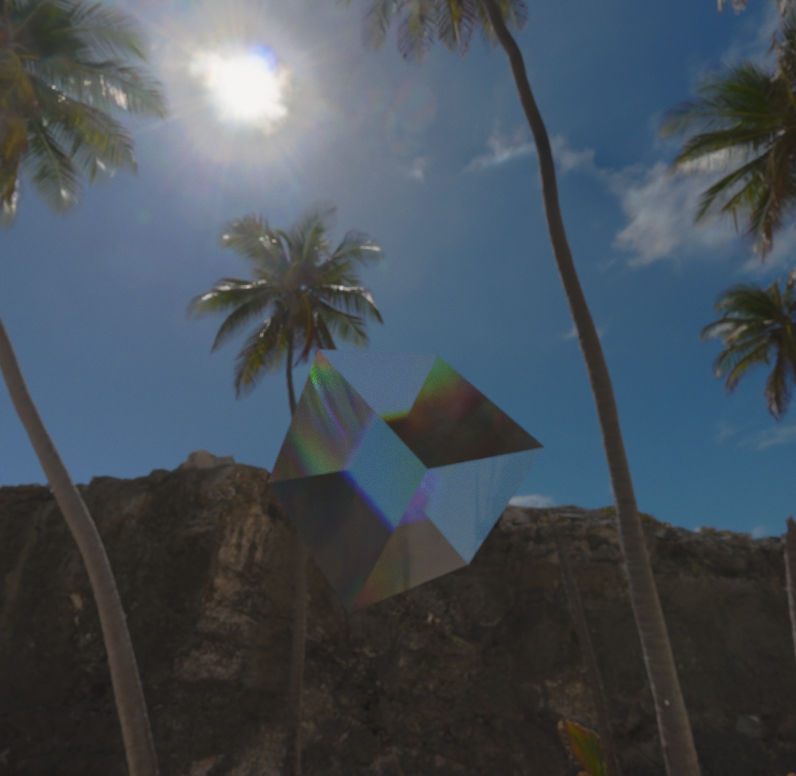
      
Cube Dispersion with coefficent 0.4

    </td>
  </tr>
</table>
      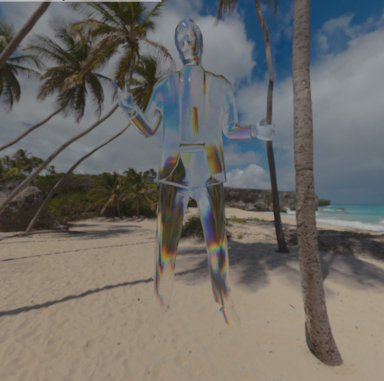
      
Saul Dispersion with coefficent 0.8

Although this creates colorful effects, the image visibly converges slower since each pixel starts off as a different color before it eventually converges to its actual color, even with no glass or dispersive objects in the scene.

<table>
  <tr>
    <td>
      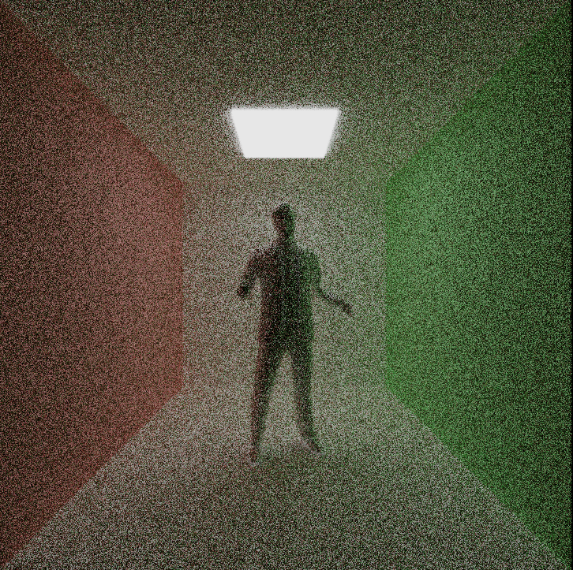
      
Pathtracing at Iteration 1 without Dispersion

    </td>
    <td>
      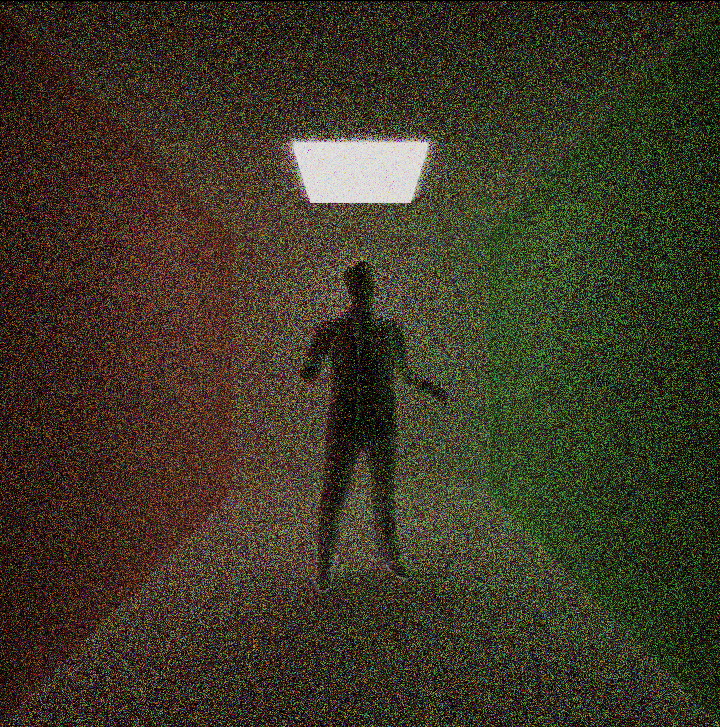
      
Pathtracing at Iteration 1 with Dispersion

    </td>
  </tr>
</table>

### Procedural Shapes

### Procedural Textures

### Denoising

Finally, even if we waited for 5000 samples per pixel, most of these images would not have looked very smooth. This is where denoising comes in. I implemented Intel's [Open Image Denoise Library](https://www.openimagedenoise.org/) within my pathtracer to help speed things along and look better. The Library is a pretrained machine learning algorithm built to denoise rendered/path traced images.

To aid with this, I passed in prefiltered (denoised themselves) albedo and normal buffers to contribute to a more accurately denoised image.

<table>
  <tr>
    <td>
      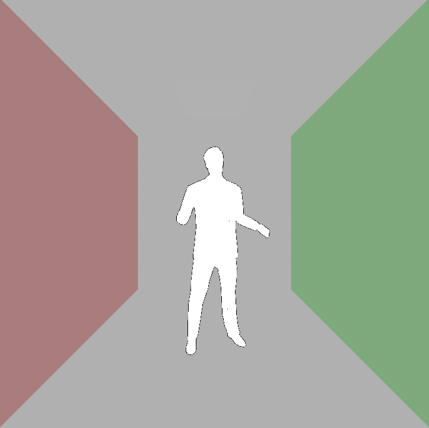
      
Albedo Buffer

    </td>
    <td>
      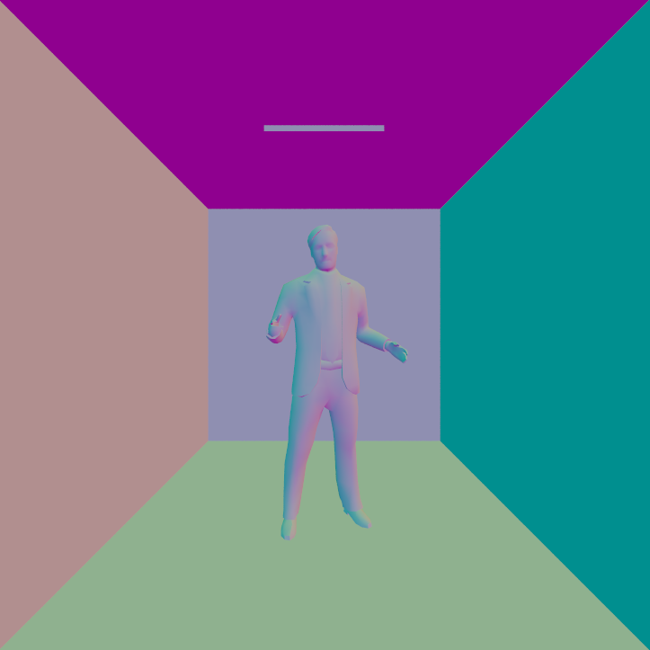
      
Normal Buffer

    </td>
  </tr>
  <tr>
    <td>
      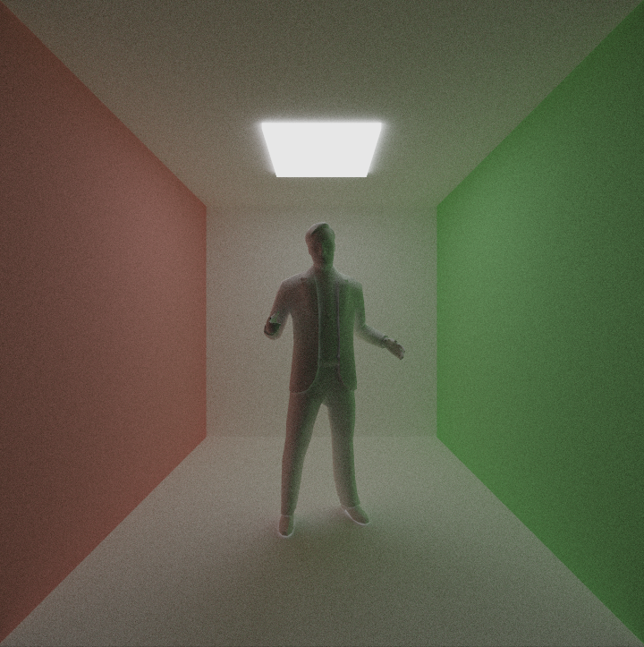
      
Image @ 1000 spp without Denoising

    </td>
    <td>
      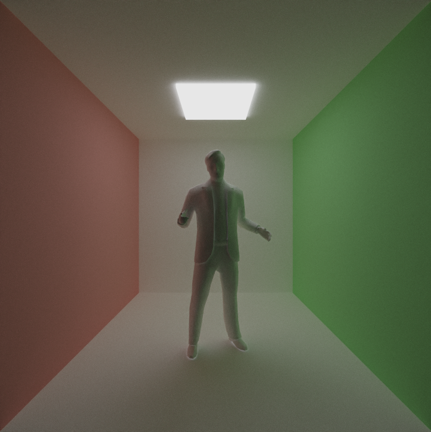
      
Denoised Image @ 1000 spp

    </td>
  </tr>
</table>

The image denoises through a preset frame interval. If we set the denoiser to run often (ex. every other frame), we get a less accurate image, but sometimes it can look pretty painterly.

## Performance Features

Next, I'll go through the features I implemented to make things faster, as well as a performance comparison.

### Bounding Volume Hierarchy

With more complex meshes, it becomes difficult to naively check for intersection with every single triangle, every frame, for each ray, for each bounce! Instead, acceleration structures are used to more efficiently test for which triangles the ray might intersect on a given bounce.

The structure that I implemented was a Bounding Volume Hierarchy, or BVH. This is essentially a tree of triangles in three dimensional world space in which we can traverse by testing each "node" of the tree's intersection with our ray to change our overall complexity from O(n) to O(logn), where n is the number of triangles in a scene.

#### BVH Performance Based on Scene Complexity

### Stream Compaction

#### Scene Performance with Stream Compaction

### Material Sorting

#### Scene Performance with Material Sorting

## Bloopers

Since this wasn't the easiest project to implement, here are some blooper images for fun!

## References

### Models

### Resources
